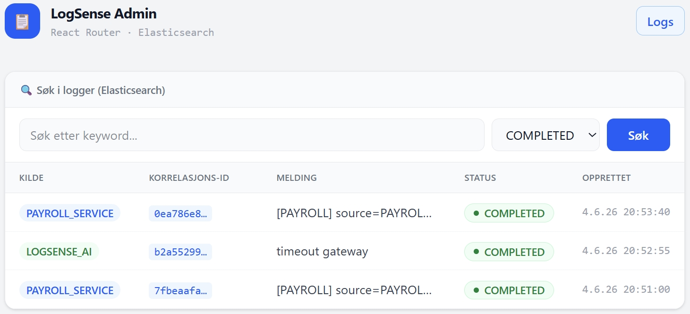

# logsense-admin

LogSense Admin — et lesevenlig admin-panel for historisk loggsøk og AI-analysevisning, bygget med React Router v7 og Elasticsearch. Kommuniserer med logsense-ai-backend for å søke opp logger via correlationId, status og keyword.

## 🎥 Demo

### 🎬 Admin - Klikk på bildet nedenfor for å se hele demoen på YouTube ▶️

[](https://www.youtube.com/watch?v=ZCdMNYNX47w&list=PLOwWtF7kBLb8EYRrO9Z94Oalhewrdnwmj)

## Oversikt

React Router v7-applikasjon som lar administratorer søke opp historiske logger fra Elasticsearch og se AI-genererte analyseresultater per log-oppføring. Søkeresultater lastes server-side via loader, og URL-en er alltid synkronisert med søketilstanden for enkel deling og navigasjon.

## Funksjoner

- Elasticsearch-basert loggsøk med keyword og statusfilter
- Server-side datainnlasting via React Router v7 `loader`
- Shareable URL — søketilstand synkronisert med URL (`/logs?q=timeout&status=FAILED`)
- Detaljvisning per log med AI-analyseresultat (`/logs/:correlationId`)
- Ingen innlogging nødvendig — kun lesetilgang
- Sortert etter nyeste oppføring først
- Server-side rendering (SSR) via React Router v7

## Teknologi

| Teknologi    | Versjon |
| ------------ | ------- |
| React        | 19+     |
| React Router | v7      |
| TypeScript   | 5+      |
| Vite         | 5+      |
| Tailwind CSS | 4+      |

## Kom i gang

**Forutsetninger:** Node.js 18+ og 🔗 [Backend (Java Spring Boot + Kafka)](https://github.com/wasana007/logsense-ai-backend) kjørende på `http://localhost:8080`

```bash
npm install
npm run dev
```

Åpnes på `http://localhost:5173`

## Konfigurasjon

Konfigureres i `app/config.ts`:

| Konstant                 | Standard                     | Beskrivelse                |
| ------------------------ | ---------------------------- | -------------------------- |
| `API_BASE_URL`           | `http://localhost:8080`      | logsense-ai-backend        |
| `API_LOGS_SEARCH`        | `/api/v1/logs/search`        | Elasticsearch keyword-søk  |
| `API_LOGS_SEARCH_STATUS` | `/api/v1/logs/search/status` | Elasticsearch statusfilter |

## Relasjon til backend

```
logsense-admin (port 5173)
      │
      │  GET /api/v1/logs/search?q=          → Elasticsearch keyword-søk
      │  GET /api/v1/logs/search/status/{s}  → Elasticsearch statusfilter
      │  GET /api/v1/logs/{correlationId}    → Hent enkelt log-oppføring
      ▼
logsense-ai-backend (port 8080)
```

## Prosjektstruktur

```
app/
├── root.tsx                       # Layout, header, nav, footer
├── app.css                        # Tailwind CSS-konfigurasjon
├── config.ts                      # Alle konfigurasjonskonstanter
├── routes.ts                      # Route-konfigurasjon
├── types/
│   └── log.ts                     # Delte domenetyper (LogDocument)
├── utils/
│   ├── formatDate.ts              # Formaterer ISO-datostreng til norsk datoformat
│   └── sortByDate.ts              # Sorterer logger etter dato synkende
└── routes/
    ├── home.tsx                   # Redirect → /logs
    ├── logs.tsx                   # loader: Elasticsearch-søk + resultatvisning
    └── logs.$id.tsx               # loader: Log detaljer + AI-analyseresultat

react-router.config.ts             # SSR-konfigurasjon og fremtidige flagg
```

## Scripts

```bash
npm run dev          # Start utviklingsserver
npm run build        # Bygg for produksjon
npm run preview      # Forhåndsvis produksjonsbygg
npm run typecheck    # TypeScript typesjekk
npm run lint         # ESLint kodesjekk
npm run format       # Prettier kodeformatering
```

## Testing

```bash
npx vitest run                  # Kjør alle tester
npx vitest run --coverage       # Kjør tester med coverage-rapport
npx playwright test             # Kjør E2E-tester
npx playwright test --ui        # Kjør E2E-tester med UI
npx playwright test --debug     # Debug E2E-tester
npx playwright show-report      # Vis testrapport
```
